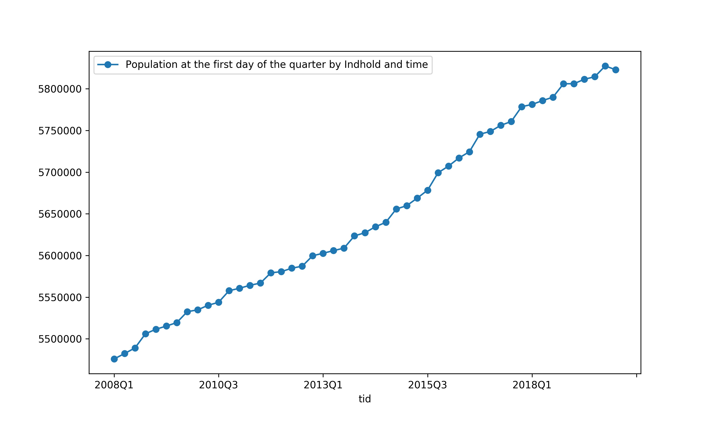

# denstatbank


A python wrapper to Statistics Denmark's Databank API.
The package allows you to easily gather and analyse data on a variety of 
topics made available by [Statistics Denmark](https://www.dst.dk/en).

The package provides a simple interface for professional statisticians, 
academics, policymakers, students, journalists and anyone interested in 
quantitative facts about Denmark.


### Installation

The package is listed on pypi - the python package index, and 
can be installed with pip as:
```
pip install --upgrade denstatbank
```

### Usage

#### A walkthrough example

Let us walkthrough a quick example of how to query for data on a specific
topic. The first step is to instantiate the client. This is easily done with 
the following two lines of code. 

```
>>> from denstatbank import StatBankClient
>>> sbc = StatBankClient(lang='en')
```

Now, let's find a table to get data from the databank. The tables method provides
a list of all tables containing data currently available in the databank.
Let's take a look at the first table.

```
>>> tdf = sbc.tables()
>>> tdf.iloc[0]
id                                                  FOLK1A
text            Population at the first day of the quarter
unit                                                number
updated                                2020-02-11T08:00:00
firstPeriod                                         2008Q1
latestPeriod                                        2020Q1
active                                                True
variables         [region, sex, age, marital status, time]
```

All data tables have values associated with certain variables specific
to the table. The population table that we shall look at has five such
variables with the names you see above.
The variables themselves have a list of valid values. One quick way of
finding acceptable values for the variables is by using the tableinfo
method as follows:

```
>>> vdf = sbc.tableinfo('folk1a', variables_df=True)
>>> years = vdf[vdf['variable']=='time']['id'].tolist()
```

We have now extracted the list of all acceptable values for the variable 'time'.
Now, we need to put this inside a dictionary where the dictionary key
is the variable name (in Danish, so 'time' becomes 'tid'). 
The client has a method called `variable_dict()` which does this for you.

```
>>> tid = sbc.variable_dict(code='tid', values=years)
```

Finally, we query the data by passing the table id and the variables
dictionary as a keyword arguments. The dictionary must be placed inside
a list as the method can accept more than one variables dictionary.

```
>>> df = sbc.data(table_id='folk1a', variables=[tid])
>>> df.head()
          Population at the first day of the quarter by Indhold and time
tid                                                                   
2008Q1                                            5475791             
2008Q2                                            5482266             
2008Q3                                            5489022             
2008Q4                                            5505995             
2009Q1                                            5511451
```

And there we have the population data. Let us quickly plot it to get a feel
for the data.

```
>>> df.plot(style='o-', figsize=(10, 6))
```


denstatbank uses the pandas python library to facilitate the handling of 
data. Pandas is a fast, popular and powerful library used for data analysis and
manipulation. It is therefore well suited to be used with this package. 
There are plenty of resources available to learn from if you are new to pandas.
I would highly recommend this [book](https://wesmckinney.com/pages/book.html) 
by the creator of the pandas himself.


### Documentation

The detailed package documentation can be found [here](https://denstatbank.readthedocs.io/en/latest/).

The official Databank API documentation can be found [here](https://www.dst.dk/en/Statistik/statistikbanken/api).
