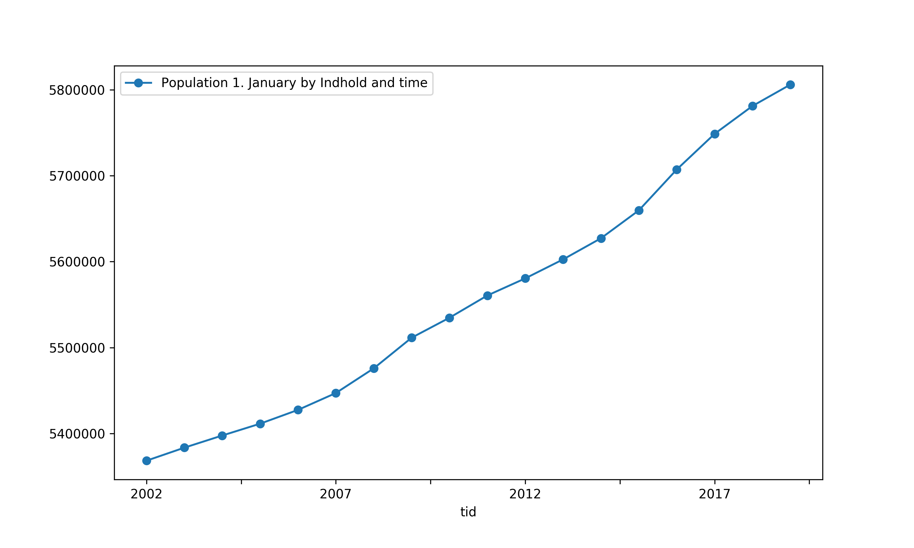

# denstatbank


A python wrapper to Statistics Denmark's Databank API.
The package allows you to easily gather data on a variety of topics made available by [Statistics Denmark](https://www.dst.dk/en).

The package provides a simple interface for professional statisticians, academics, policymakers, students, 
and anyone interested in quantitative facts about Denmark.


### Installation

The package is listed on pypi and can be installed with pip:
```
pip install denstatbank
```

### Usage

Quick Example 
```python
>>> from denstatbank import StatBankClient
>>> sbc = StatBankClient(lang='en')
>>> years = [str(y) for y in list(range(2002, 2020))]
>>> tid = sbc.make_variable_dict(code='Tid', values=years)
>>> df = sbc.data(table_id='bef5', variables=[tid], as_df=True))
>>> df.plot(style='o-', figsize=(10, 6))
```


`denstatbank` utilizes the power of `pandas`, a fast and flexible library
eminently suited for data handling and analysis. 

### Todo

Examples demonstrating statistical analysis of data

### Links
The official API documentation can be found [here](https://www.dst.dk/en/Statistik/statistikbanken/api)
