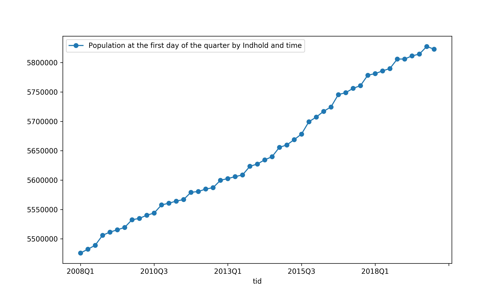

.. denstatbank documentation master file, created by
   sphinx-quickstart on Tue Mar 24 12:48:52 2020.
   You can adapt this file completely to your liking, but it should at least
   contain the root `toctree` directive.

Welcome to denstatbank's documentation!
=======================================

denstatbank is a python wrapper to Statistics Denmark's Databank API.
The package allows you to easily gather data on a variety of topics made 
available by Statistics Denmark.

A walkthrough example
---------------------

Let us walkthrough a quick example of how to query for data on a specific
topic. The first step is to instantiate the client. This is easily done with 
the following two lines of code.  

.. code-block:: python

   >>> from denstatbank import StatBankClient
   >>> sbc = StatBankClient(lang='en')
   

Now, let's find a table to get data from the databank. The tables method provides
a list of all tables containing data currently available in the databank.
Let's go with the very first one.

.. code-block:: python

   >>> tdf = sbc.tables()
   >>> tdf.iloc[0]
   id                                                  FOLK1A
   text            Population at the first day of the quarter
   unit                                                number
   updated                                2020-02-11T08:00:00
   firstPeriod                                         2008Q1
   latestPeriod                                        2020Q1
   active                                                True
   variables         [region, sex, age, marital status, time]

All data tables have values associated with certain variables specific
to the table. The population table that we shall look at has five such
variables with the names you see above.
The variables themselves have a list of valid values. One quick way of
finding acceptable values for the variables is by using the tableinfo
method as follows:

.. code-block:: python

   >>> vdf = sbc.tableinfo('folk1a', variables_df=True)
   >>> years = vdf[vdf['variable']=='time']['id'].tolist()

We have now extracted the list of all acceptable values for the variable 'time'.
Now, we need to put this inside a dictionary where the dictionary key
is the variable name (in Danish). The variable_dict method that you can
call with the client does this for you.

.. code-block:: python

   >>> tid = sbc.variable_dict(code='tid', values=years)

Finally, we query the data with the table id and pass the variables
dictionary inside of a list. You must use a list here since more than
one variable can be passed. 

.. code-block:: python

   >>> df = sbc.data(table_id='folk1a', variables=[tid])
   >>> df.head()
              Population at the first day of the quarter by Indhold and time
   tid                                                                   
   2008Q1                                            5475791             
   2008Q2                                            5482266             
   2008Q3                                            5489022             
   2008Q4                                            5505995             
   2009Q1                                            5511451

And there we have the population data. Let us quickly plot it to get a feel
for the data.

.. code-block:: python

   >>> df.plot(style='o-', figsize=(10, 6))

denstatbank uses the pandas python library to facilitate the handling of 
data. Pandas is a fast, popular and powerful library used for data analysis and
manipulation. It is therefore well suited to be used with this package. 
There are plenty of resources available to learn from if you are new to pandas.
I would highly recommend this `book <https://wesmckinney.com/pages/book.html>`_ 
by the creator of the library himself.

Code Documentation
------------------

That was just a quick demonstration of what you can do. To learn more, 
have a look at the detailed documentation of the client methods which 
details the different parameter options and includes examples.

.. toctree::
   :maxdepth: 2

   denstatbank.denstatbank
   denstatbank.utils

Statistical Analysis
--------------------

I hope to include a couple of examples demonstrating statistical and time
series analysis that you can perform on the data available via the API.
You will be able to find them on the package 
`github page <https://github.com/gmohandas/denstatbank>`_.

Other Links
-----------

The documentation for the Databank API can be found 
`here <https://www.dst.dk/en/Statistik/statistikbanken/api>`_.

Here, is the official website of 
`Statistics Denmark <https://www.dst.dk/en>`_.

.. :caption: Contents:

.. Indices and tables
.. ==================

.. * :ref:`genindex`
.. * :ref:`modindex`
.. * :ref:`search`
